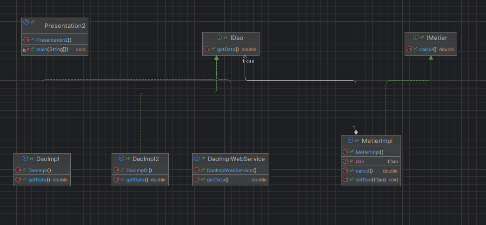

<h2>Injection des dépendances par instanciation dynamique </h2>

<h2> Recap sur Maven </h2>

<h4>*Les commandes de Maven* </h4>

 > <b>mvn compile :</b> compiler les fichier .java

 > <b>mvn test :</b> executerv tous les tests unitaires dans tout le projet

 > <b>mvn package :</b> regrouper tous les classes et les ressources du projet et générer le package soit .jar ou .war

 > <b>mvn install :</b> prendre le jar ou bien le war généré et le mettre dans le repository local de Maven

 > <b>mvn deploy :</b> prendre .war et l envoyer vers un serveur d'application et le deployer dans un serveur de production 

 > <b>mvn site :</b> génerer les fichier .html dans lesquels on trouve la documentation de projet(javadoc)
